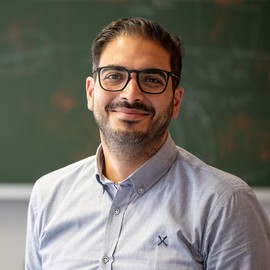
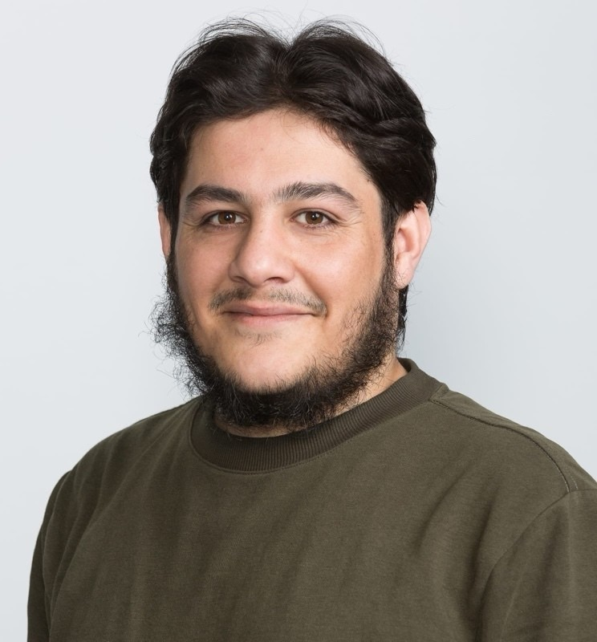
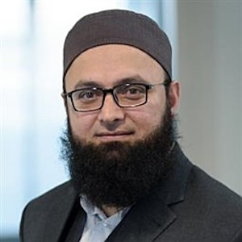

---
#
# By default, content added below the "---" mark will appear in the home page
# between the top bar and the list of recent posts.
# To change the home page layout, edit the _layouts/home.html file.
# See: https://jekyllrb.com/docs/themes/#overriding-theme-defaults
#
layout: home
---

  <h3>2nd Workshop on</h3>
  <h1>Foundation AI Models in Biomedical Imaging</h1>
  <h3> at</h3>
  <h3><a href="https://biomedicalimaging.org/2026/">IEEE International Conference on Biomedical Imaging (ISBI) 2026</a></h3>
  <h3> April 2026</h3>
  <h3> London, United Kingdom</h3>
  

# About
Foundation AI models are generalistic AI models that have recently garnered huge attention in the AI research community. Foundation AI models bring scalability and broad applicability and, thus, possess transformative potential in medical imaging applications, including (but not limited to) synthesis of medical image data, automatic report generation from radiology images, cross-lingual report generation, and image analysis. This workshop aims to explore new applications of foundations AI models in biomedical imaging with a focus on multimodal foundation models for multimodality medical data comprising medical images (radiology, pathology, fundus, etc), electronic health records, medical reports, radiomics, etc. Furthermore, the workshop will also provide a platform to identify the practical challenges of implementing foundation AI models in the biomedical imaging domains and the potential solutions related to the robustness, trustworthiness, and explainability of the medical foundation AI models. Thus, the workshop will offer an understanding of the impact of foundation AI models on the biomedical imaging domain. The workshop will comprise keynote presentations by experts, contributed paper presentations, poster sessions, and a panel discussion to encourage knowledge sharing, ideas exchange, and collaboration among the participants.

# Invited Speakers

  

    
    
<strong>Prof. Shadi Albarqouni</strong>

    
University of Bonn, Germany

  

  

    
    
<strong>Dr. Chen Qin</strong>

    
Imperial College London, UK

  

  

    
    
<strong>Dr. Dwarikanath Mahapatra</strong>

    
Khalifa University, UAE

  

  

    
    
<strong>Dr. muzammil Behzad</strong>

    
KFUPM, Saudi Arabia

  

# Call for featured talks
We welcome submissions of abstracts for **featured talks** at the workshop. If you are attending IEEE ISBI 2026 and would like to present your work at the FAIBI workshop too, please fill in this simple form so that the organizers can include your talk in the workshop program. This will be included as a featured talk and should be limited to 10 minutes duration + a 5-minute question-answer session. 

[Click here to submit title of your talk](https://docs.google.com/forms/d/e/1FAIpQLSe96IR-Y2_DSLN4-5-fLwnhukNonTVkOLhZvRqe85nZ0nkYjA/viewform?usp=sharing&ouid=111091430880916872727)

# Where and When
April, 2026

*ExCel London*

# Schedule
to be updated
<!-- <table border="1">
    <tr>
        <th>Time</th>
        <th>Talk</th>
        <th>Speaker</th>
        <th>Title</th>
    </tr>
    <tr>
        <td>9:00 am</td>
        <td>Invited talk</td>
        <td>Speaker 1</td>
        <td><strong>Title 1 Title 1 Title 1 Title 1 Title 1 Title 1 Title 1 Title 1</strong>
            

                
Read abstract

                Abstract 1. Abstract 1. Abstract 1. Abstract 1. Abstract 1. Abstract 1. Abstract 1. Abstract 1. Abstract 1. Abstract 1. Abstract 1. Abstract 1. Abstract 1. Abstract 1. Abstract 1. Abstract 1. Abstract 1. Abstract 1. 
            

        </td>
    </tr>
    <tr>
        <td>09:40 am</td>
        <td>Featured talk</td>
        <td>Speaker 2</td>
        <td>
            <strong>Title 2</strong>
            

                
Read abstract

                Abstract 2. Abstract 2. Abstract 2. Abstract 2. Abstract 2. Abstract 2. Abstract 2. Abstract 2. Abstract 2. Abstract 2. Abstract 2. Abstract 2. Abstract 2. Abstract 2. Abstract 2. Abstract 2. Abstract 2. Abstract 2. 
            

        </td>
    </tr>
    <tr>
        <td>09:50 am</td>
        <td>Featured talk</td>
        <td>Speaker name To be updated </td>
        <td>
            <strong>Self-supervised learning for chest x-ray analysis</strong>
            

                
Read abstract

                To be updated To be updated To be updated To be updated To be updated To be updated To be updated To be updated To be updated To be updated To be updated To be updated To be updated To be updated To be updated To be updated To be updated To be updated To be updated To be updated 
            

        </td>
    <tr>
    <td colspan="4" style="text-align: center;">10:00 - 10:30 am <strong>Coffee Break</strong></td>
    </tr>
    <tr>
        <td>10:30 am</td>
        <td>Invited talk</td>
        <td>Kun Zhang</td>
        <td>
            <strong>Title To be updated To be updated To be updated To be updated To be updated To be updated </strong>
            

                
Read abstract

                To be updated To be updated To be updated To be updated To be updated To be updated To be updated To be updated To be updated 
            

        </td>
    </tr>
    <tr>
        <td>11:00 am</td>
        <td>Invited talk</td>
        <td>Speaker name To be updated  </td>
        <td>
            <strong>Title To be updated </strong>
            

                
Read abstract

                To be updated To be updated To be updated To be updated To be updated To be updated To be updated To be updated To be updated To be updated 
            

        </td>
    </tr>
        <td>11:30 am</td>
        <td>Closing Remarks </td>
        <td>Workshop chairs </td>
        <td>
            <strong>Closing Remarks and Note of Thanks</strong>
        </td>
    </tr>
</table> -->

# Organizers

  

    
    
<strong>Dr. Hazrat Ali</strong>

    
University of Stirling, UK

  

  

    
    
<strong>Dr. Rizwan Qureshi</strong>

    
Associate Prof. Salim Habib University Karachi

  

 

  

    
    
<strong>Dr. Islem Rekik</strong>

    
Imperial College London, UK

  

  

    
    
<strong>Prof. Jia Wu</strong>

    
MD Anderson Cancer Center, USA

  
 

  

    
    
<strong>Prof. Muhammad Bilal</strong>

    
Birmingham City University, UK

  

# Contact us
**Dr. Hazrat Ali**, ali.hazrat@stir.ac.uk 

---

# Organizers' affiliations

  

    
  

  

    
  

  

    
  

  

    
  

  

    
  

---

