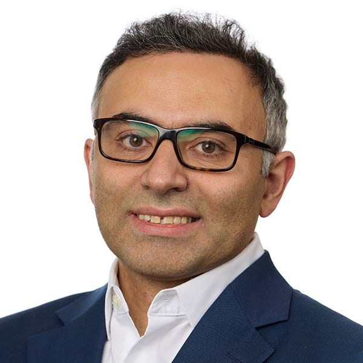
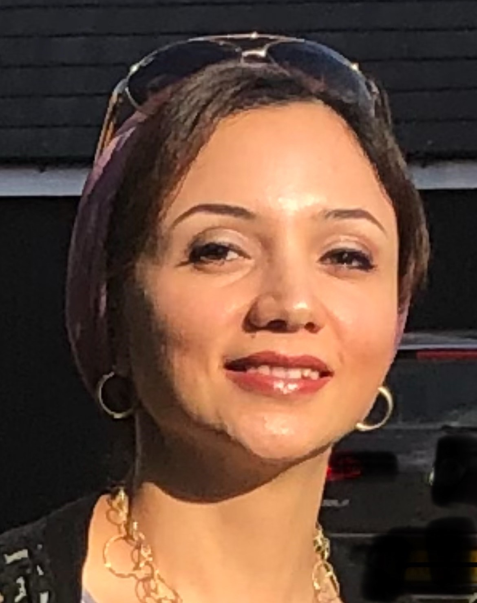
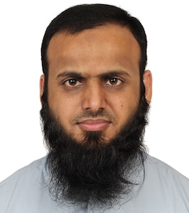
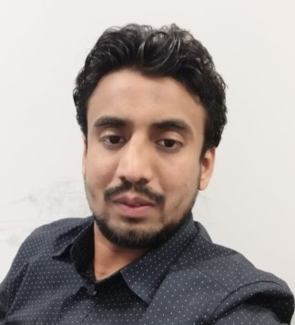
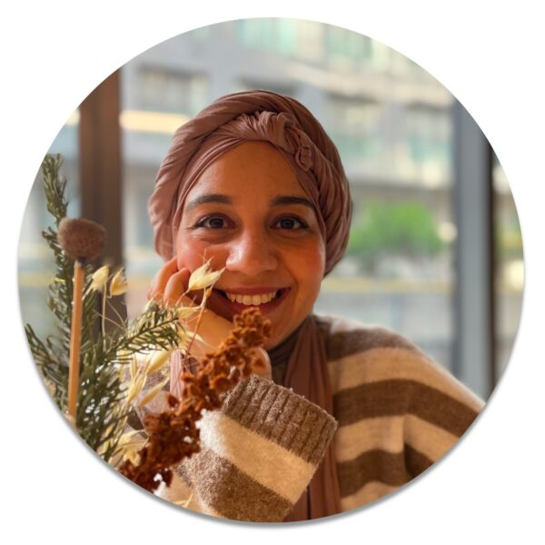
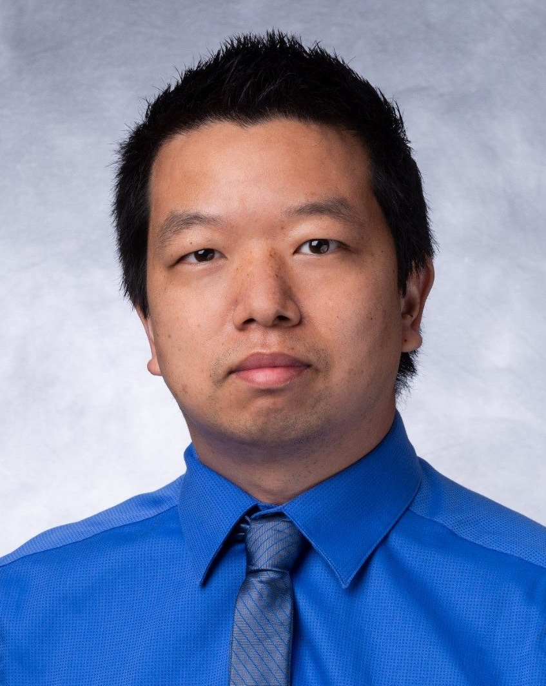

---
#
# By default, content added below the "---" mark will appear in the home page
# between the top bar and the list of recent posts.
# To change the home page layout, edit the _layouts/home.html file.
# See: https://jekyllrb.com/docs/themes/#overriding-theme-defaults
#
layout: home
---

  <h3>Workshop on</h3>
  <h1>Foundation AI Models in Biomedical Imaging</h1>
  <h3> at</h3>
  <h3><a href="https://biomedicalimaging.org/2025/">IEEE International Conference on Biomedical Imaging (ISBI) 2025</a></h3>
  <h3> 15 April 2025</h3>
  <h3> Houston, TX, USA</h3>
  

# About
Foundation AI models are generalistic AI models that have recently garnered huge attention in the AI research community. Foundation AI models bring scalability and broad applicability and, thus, possess transformative potential in medical imaging applications, including (but not limited to) synthesis of medical image data, automatic report generation from radiology images, cross-lingual report generation, and image analysis. This workshop aims to explore new applications of foundations AI models in biomedical imaging with a focus on multimodal foundation models for multimodality medical data comprising medical images (radiology, pathology, fundus, etc), electronic health records, medical reports, radiomics, etc. Furthermore, the workshop will also provide a platform to identify the practical challenges of implementing foundation AI models in the biomedical imaging domains and the potential solutions related to the robustness, trustworthiness, and explainability of the medical foundation AI models. Thus, the workshop will offer an understanding of the impact of foundation AI models on the biomedical imaging domain. The workshop will comprise keynote presentations by experts, contributed paper presentations, poster sessions, and a panel discussion to encourage knowledge sharing, ideas exchange, and collaboration among the participants.

# Invited Speakers

  

    
    
<strong>Dr. Kayhan Batmanghelich</strong>

    
Boston University, USA

  

  

    
    
<strong>Dr. Kun Zhang</strong>

    
Carnegie Mellon University, USA

  

    

    
    
<strong>Dr. Shereen Fouad </strong>

    
Aston University, UK

  

  <!-- 

    
    
<strong>Dr. Dwarikanath Mahapatra</strong>

    
Inception Institute of AI, UAE

  
 -->

# Call for featured talks
~~We welcome submissions of abstracts for **featured talks** at the workshop. If you are attending IEEE ISBI 2025 and would like to present your work at the FAIBI workshop too, please fill in this simple form so that the organizers can include your talk in the workshop program. This will be included as a featured talk and should be limited to 10 minutes duration + a 5-minute question-answer session. [Click here to submit title of your talk](https://docs.google.com/forms/d/e/1FAIpQLScFEII8VCPAK464FKQ61og2X9YUPrqv-Frf1L32Ys1ve5ssHg/viewform?usp=header)~~

# Where and When
15 April 2025 (Morning)

Hyatt Regency Houston Downtown, Houston, Texas, USA.

*Room Arboretum 4-5 (F2)*

# Schedule
<table border="1">
    <tr>
        <th>Time</th>
        <th>Talk</th>
        <th>Speaker</th>
        <th>Title</th>
    </tr>
    <tr>
        <td>9:00 am</td>
        <td>Invited talk</td>
        <td>Kayhan Batmanghelich</td>
        <td><strong>Beyond One-Size-Fits-All: Foundational Models for Organ-Centric Medical Imaging</strong>
            

                
Read abstract

                The rapid advancement of artificial intelligence has spurred a growing shift toward foundational models, including in applied fields like medical imaging. These models promise to streamline the development process by replacing multiple task-specific models with a single, versatile framework trained on large multimodal data. While this concept is compelling and early results are encouraging, our analysis reveals that current foundational models fall short in addressing the unique complexities of medical imaging. In this talk, I propose a middle-ground solution: organ-specific foundational models tailored to domains such as lung and breast imaging. Drawing from our recent works, Mamo-CLIP and MedSyn, I will highlight both the potential and the limitations of this approach. By addressing key challenges—including data scarcity, annotation burden, and anatomical variability—I will discuss practical strategies for building effective domain-specific foundational models. The talk will conclude with a forward-looking perspective on opportunities to advance foundational model development in medical imaging.
            

        </td>
    </tr>
    <tr>
        <td>09:40 am</td>
        <td>Featured talk</td>
        <td>Abhiram Kandiyana</td>
        <td>
            <strong>Automatic Classification of Microscopy Images using multi-modal LLMs</strong>
            

                
Read abstract

                Current AI-based methods for the classification of cellular features (number, activation state) in microscopy images require time- and labor-intensive processes for training models. Specific limitations include the need for large numbers of images and major time commitments from domain experts for accurate ground truthing. This poster presents a solution that overcomes these limitations using a state-of-the-art vision language model (VLM) and few-shot prompting while maintaining equivalence in accuracy compared to the baseline. Rather than training with images from each class, the models input consists of minimal ground-truth prompts for visual question answering. Furthermore, our novel human-in-the-loop approach automates the selection of example image-text pairs as input prompts and generates explanatory text as the basis for separating images into distinct classes.
            

        </td>
    </tr>
    <tr>
        <td>09:50 am</td>
        <td>Featured talk</td>
        <td>Syed Anwar</td>
        <td>
            <strong>Self-supervised learning for chest x-ray analysis</strong>
            

                
Read abstract

                Chest X-Ray (CXR) is a widely used clinical imaging modality and has a pivotal role in the diagnosis and prognosis of various lung and heart related conditions. Conventional automated clinical diagnostic tool design strategies relying on radiology reads and supervised learning, entail the cumbersome requirement of high quality annotated training data. To address this challenge, self-supervised pre-training has proven to outperform supervised pre-training in numerous downstream vision tasks, representing a significant breakthrough in the field. However, medical imaging pre-training significantly differs from pre-training with natural images (e.g., ImageNet) due to unique attributes of clinical images. In this talk, I will present a self-supervised training paradigm that leverages a student teacher framework for learning diverse concepts and hence effective representation of the CXR data. Hence, expanding beyond merely modeling a single primary label within an image, instead, effectively harnessing the information from all the concepts inherent in the CXR. The pre-trained model is subsequently fine-tuned to address diverse domain-specific tasks. Our proposed paradigm consistently demonstrates robust performance across multiple downstream tasks on multiple datasets, highlighting the success and generalizability of the pre-training strategy. The training strategy has been extended for federated learning (FL), which could alleviate the burden of data sharing and enable patient privacy. I will briefly talk about the privacy landscape of FL and potential data leakage within the FL paradigm.
            

        </td>
    <tr>
    <td colspan="4" style="text-align: center;">10:00 - 10:30 am <strong>Coffee Break</strong></td>
    </tr>
    <tr>
        <td>10:30 am</td>
        <td>Invited talk</td>
        <td>Kun Zhang</td>
        <td>
            <strong>Causal Representation Learning for Generative AI</strong>
            

                
Read abstract

                Causality is a fundamental notion in science, engineering, and even in machine learning. Uncovering the causal process behind observed data can naturally help answer 'why' and 'how' questions, inform optimal decisions, and achieve adaptive prediction. In many scenarios, observed variables (such as image pixels and questionnaire results) are often reflections of the underlying causal variables rather than being causal variables themselves. Causal representation learning aims to reveal the underlying hidden causal variables and their relations. In this talk, we show how the modularity property of causal systems makes it possible to recover the underlying causal representations from observational data with identifiability guarantees: under appropriate assumptions, the learned representations are consistent with the underlying causal process. We demonstrate how identifiable causal representation learning can naturally benefit generative AI, with image generation, image editing, and text generation as particular examples.
            

        </td>
    </tr>
    <tr>
        <td>11:00 am</td>
        <td>Invited talk</td>
        <td>Shereen Fouad </td>
        <td>
            <strong>Leveraging the Power of Hybrid Deep Learning Models for Enhanced Medical Imaging Segmentation</strong>
            

                
Read abstract

                This talk explores the power of hybrid deep learning models for medical imaging segmentation, focusing on two challenging applications: mandibular canal (MC) segmentation in Cone Beam Computed Tomography (CBCT) and ground glass opacity (GGO) segmentation in chest CT scans. For MC segmentation, we propose a deep learning-based approach using 3D U-Net and 3D Attention U-Net networks, demonstrating that the 3D Attention U-Net outperforms the standard 3D U-Net with superior Dice similarity, precision, and recall values. Similarly, for GGO segmentation in chest CT scans, we introduce a ResNet-50U-Net model, which enhances feature extraction and achieves improved segmentation performance compared to traditional U-Net and DenseNet-121U-Net models. Both approaches incorporate Grad-CAM++, a post-hoc visual explainability tool that highlights key regions influencing the model's predictions, addressing the trust and transparency challenges of "black-box" deep learning models. These hybrid deep learning models provide significant advancements in medical imaging segmentation, enhancing clinical decision-making and diagnostics.
            

        </td>
    </tr>
        <td>11:30 am</td>
        <td>Closing Remarks </td>
        <td>Workshop chairs </td>
        <td>
            <strong>Closing Remarks and Note of Thanks</strong>
        </td>
    </tr>
</table>

# Organizers

  

    
    
<strong>Dr. Hazrat Ali</strong>

    
University of Stirling, UK

  

  

    
    
<strong>Dr. Rizwan Qureshi</strong>

    
University of Central Florida, USA

  

 

  

    
    
<strong>Dr. Islem Rekik</strong>

    
Imperial College London, UK

  

  

    
    
<strong>Prof. Jia Wu</strong>

    
MD Anderson Cancer Center, USA

  
 

# Contact us
**Dr. Hazrat Ali**, ali.hazrat@stir.ac.uk 

---

# Organizers' affiliations

  

    
  

  

    
  

  

    
  

  

    
  

---

