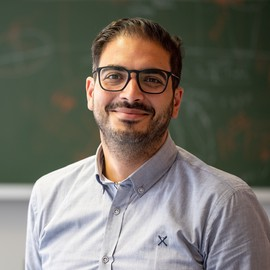
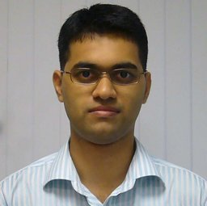
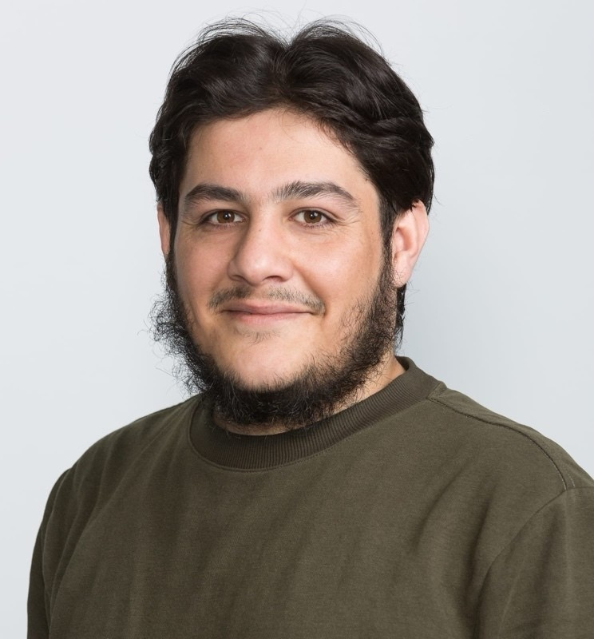
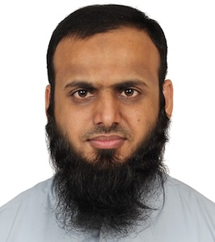
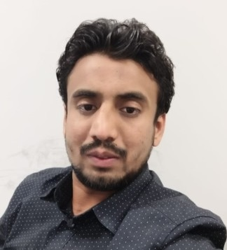
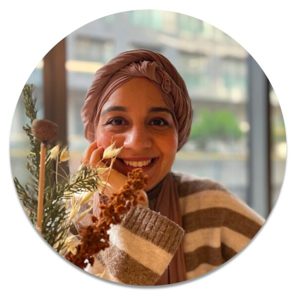
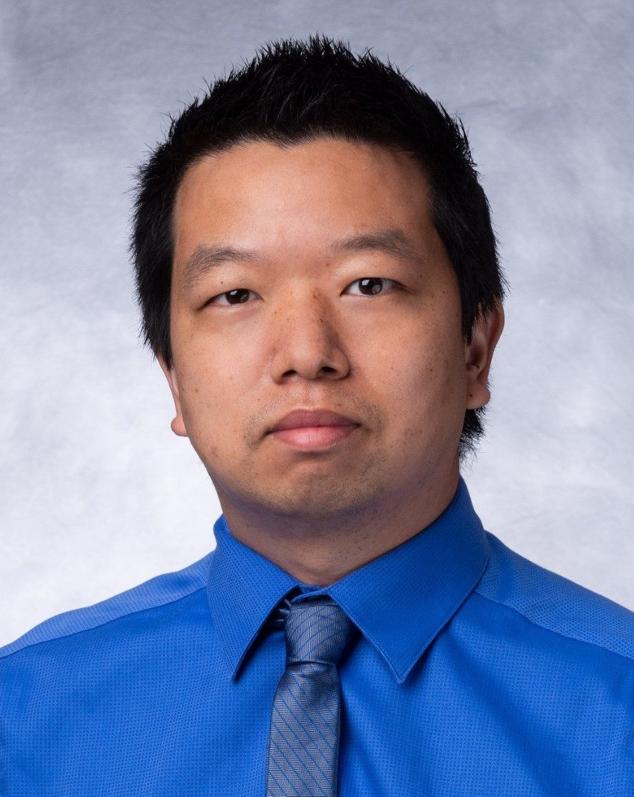
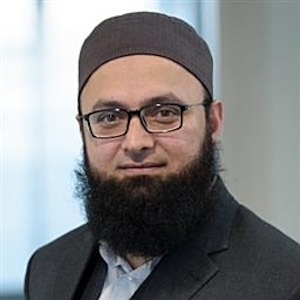

---
#
# By default, content added below the "---" mark will appear in the home page
# between the top bar and the list of recent posts.
# To change the home page layout, edit the _layouts/home.html file.
# See: https://jekyllrb.com/docs/themes/#overriding-theme-defaults
#
layout: home
---

  <h3>2nd Workshop on</h3>
  <h1>Foundation AI Models in Biomedical Imaging</h1>
  <h3> at</h3>
  <h3><a href="https://biomedicalimaging.org/2026/">IEEE International Conference on Biomedical Imaging (ISBI) 2026</a></h3>
  <h3> 11 April 2026</h3>
  <h3> London, United Kingdom</h3>
  

# About
Foundation AI models are generalistic AI models that have recently garnered huge attention in the AI research community. Foundation AI models bring scalability and broad applicability and, thus, possess transformative potential in medical imaging applications, including (but not limited to) synthesis of medical image data, automatic report generation from radiology images, cross-lingual report generation, and image analysis. This workshop aims to explore new applications of foundations AI models in biomedical imaging with a focus on multimodal foundation models for multimodality medical data comprising medical images (radiology, pathology, fundus, etc), electronic health records, medical reports, radiomics, etc. Furthermore, the workshop will also provide a platform to identify the practical challenges of implementing foundation AI models in the biomedical imaging domains and the potential solutions related to the robustness, trustworthiness, and explainability of the medical foundation AI models. Thus, the workshop will offer an understanding of the impact of foundation AI models on the biomedical imaging domain. The workshop will comprise keynote presentations by experts, contributed paper presentations, poster sessions, and a panel discussion to encourage knowledge sharing, ideas exchange, and collaboration among the participants.

# Invited Speakers

  

    
    
<strong>Prof. Shadi Albarqouni</strong>

    
University of Bonn, Germany

  

  

    
    
<strong>Dr. Chen Qin</strong>

    
Imperial College London, UK

  

  

    
    
<strong>Dr. Dwarikanath Mahapatra</strong>

    
Khalifa University, UAE

  

  

    
    
<strong>Dr. muzammil Behzad</strong>

    
KFUPM, Saudi Arabia

  

# Call for featured talks
We welcome submissions of abstracts for **featured talks** at the workshop. If you are attending IEEE ISBI 2026 and would like to present your work at the FAIBI workshop too, please fill in this simple form so that the organizers can include your talk in the workshop program. This will be included as a featured talk and should be limited to 10 minutes duration + a 5-minute question-answer session. 

[Click here to submit title of your talk](https://docs.google.com/forms/d/e/1FAIpQLSe96IR-Y2_DSLN4-5-fLwnhukNonTVkOLhZvRqe85nZ0nkYjA/viewform?usp=sharing&ouid=111091430880916872727)

# Where and When
11 April, 2026

*ExCel London*

# Schedule
Tentative schedule is given below. This will be updated to match the conference program. 

<table border="1">
    <tr>
        <th>Time</th>
        <th>Talk</th>
        <th>Speaker</th>
        <th>Title</th>
    </tr>
    <tr>
        <td>14:00</td>
        <td>Invited talk</td>
        <td>Dr. Chen Qin</td>
        <td><strong>Foundational Medical AI Beyond Supervised Learning on Incomplete Imaging and Clinical Data</strong>
            

                
Read abstract

                As the biomedical imaging community explores the potential of large-scale foundation models, a critical bottleneck remains: real-world clinical data is inherently messy, incomplete, and rarely contains perfect ground truth. To build truly foundational AI capabilities that scale to clinical workflows, the field must move beyond traditional supervised learning paradigms. This talk presents a suite of beyond-supervised methodologies designed to tackle data incompleteness at two critical stages: physical acquisition and semantic diagnosis. First, we address the challenge of incomplete imaging signals through advanced generative modeling and unsupervised reconstruction frameworks. By learning directly from partial or accelerated physical measurements, these methods enable high-fidelity image reconstruction without the strict reliance on fully sampled reference scans. Second, we transition to downstream clinical applications by exploring multimodal architectures that fuse high-dimensional images with heterogeneous clinical records. By leveraging advanced representation learning, these systems natively handle missing clinical variables and effectively utilize unannotated data, dynamically adapting to imperfect patient profiles. By advancing medical AI beyond supervised learning at both the physics and clinical levels, we provide grounded steps toward learning the robust representations required for the next generation of clinical AI. 
            

        </td>
    </tr>
    <tr>
        <td>14:40</td>
        <td>Invited Talk</td>
        <td>Dr. Muzammil Behzad</td>
        <td>
            <strong>Multimodal Medical Computer Vision: Opportunities and Challenges for Next-Generation Medical Imaging and Clinical Applications </strong>
            

                
Read abstract

                Multimodal medical computer vision is reshaping healthcare by integrating diverse data sources such as medical imaging, clinical reports, electronic health records, and emerging vision-language models to enable more comprehensive and intelligent clinical decision-making. By learning from complementary modalities, next-generation AI systems can improve diagnostic accuracy, enhance disease characterization, support personalized treatment planning, and streamline clinical workflows. However, significant challenges remain, including data heterogeneity, limited annotations, modality imbalance, interpretability, privacy concerns, and regulatory constraints. This talk will highlight key opportunities, recent advances, and open challenges in developing robust, trustworthy, and clinically deployable multimodal AI systems for the future of medical imaging and healthcare applications. 
            

        </td>
    </tr> 
    <tr>
        <td colspan="4" style="text-align: center;">15:00 - 16:00 <strong>Awards Distributiion Ceremony</strong></td>
    </tr>
    <tr>
    <tr>
        <td colspan="4" style="text-align: center;">16:00 - 16:30 <strong>Coffee Break</strong></td>
    </tr>
    <tr>
        <td>16:30 </td>
        <td>Invited Talk</td>
        <td>Prof. Shadi Albarqouni </td>
        <td>
            <strong>Rethinking Foundation Models for Medical Imaging: Toward Affordable and Multimodal AI</strong>
            

                
Read abstract

                Foundation models are rapidly transforming biomedical imaging by enabling transferable representations across tasks and datasets. However, their direct application to clinical settings raises important challenges related to bias, domain shift, annotation cost, and deployment in resource-constrained environments. In this talk, I present a series of recent works from our group exploring how foundation models can be critically evaluated and adapted to support affordable and practical AI systems for medical imaging. We first analyze bias in foundation model representations for mammography, highlighting how modality-specific characteristics can influence downstream performance. We then demonstrate applications in histopathology through CMIL grading, showing how specialized models can enable clinically relevant analysis with limited annotations. Building on these insights, we explore new paradigms enabled by multimodal foundation models, including cross-modal prompt learning and the use of vision-language models as gating mechanisms for open-set federated active learning. Together, these studies illustrate how specialized, multimodal, and annotation-efficient foundation models can enable robust and deployable AI systems for biomedical imaging, particularly in point-of-care and resource-limited settings.
            

        </td>
    </tr>
    <tr>
        <td>17:10</td>
        <td>Invited talk</td>
        <td>Dr. Dwarikanath Mahapatra</td>
        <td>
            <strong>Title to be updated </strong>
            

                
Read abstract

                Talk withdrawn. Due to the ongoing situation in the middle east, the speaker is unable to confirm travel plans.  
            

        </td>
    </tr>
    <tr> <td>17:10</td> <td>Closing Remarks </td>
        <td>Workshop chairs </td>
        <td>
            <strong>Closing Remarks and Note of Thanks</strong>
        </td>
    </tr>
</table>

# Organizers

  

    
    
<strong>Dr. Hazrat Ali</strong>

    
University of Stirling, UK

  

  

    
    
<strong>Dr. Rizwan Qureshi</strong>

    
Associate Prof. Salim Habib University Karachi

  

 

  

    
    
<strong>Dr. Islem Rekik</strong>

    
Imperial College London, UK

  

  

    
    
<strong>Prof. Jia Wu</strong>

    
MD Anderson Cancer Center, USA

  
 

  

    
    
<strong>Prof. Muhammad Bilal</strong>

    
Birmingham City University, UK

  

# Contact us
**Dr. Hazrat Ali**, ali.hazrat@stir.ac.uk 

---

# Organizers' affiliations

  

    
  

  

    
  

  

    
  

  

    
  

  

    
  

---

